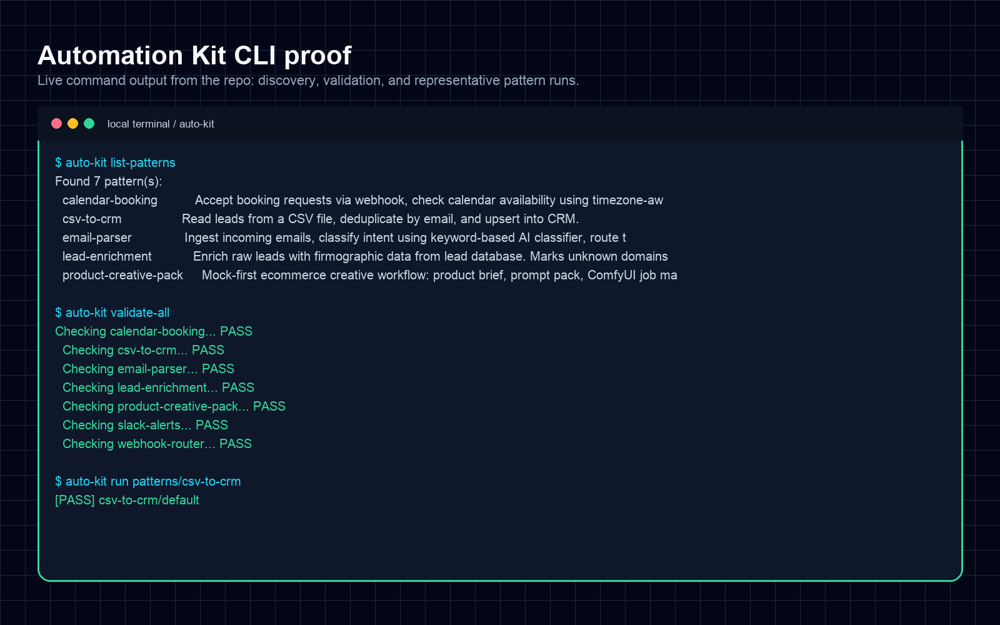
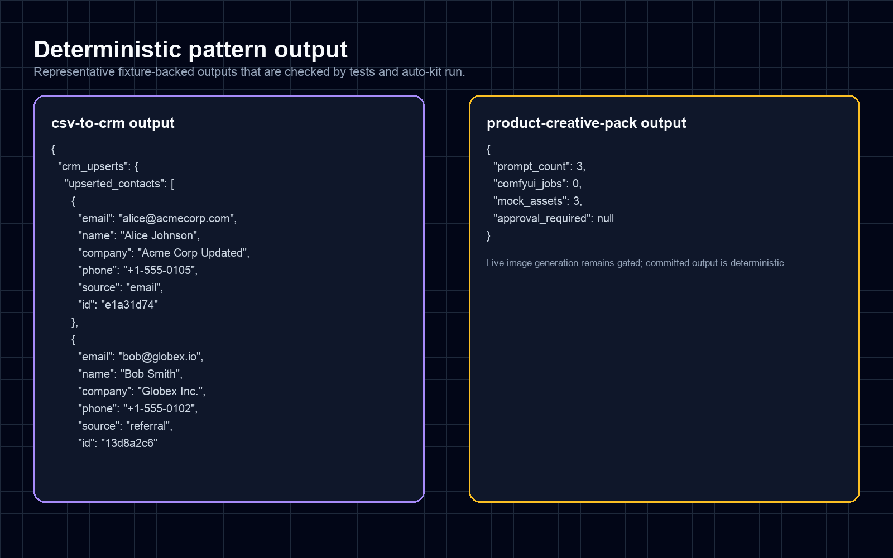
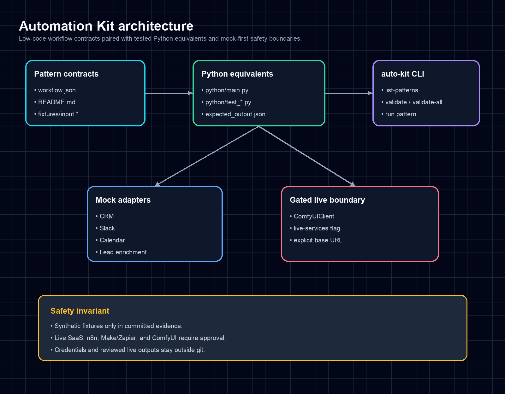
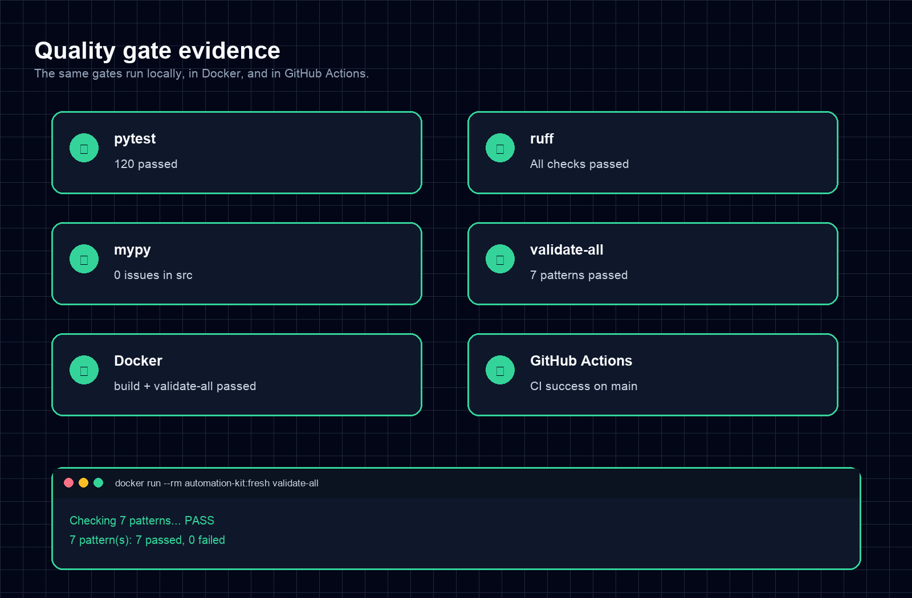
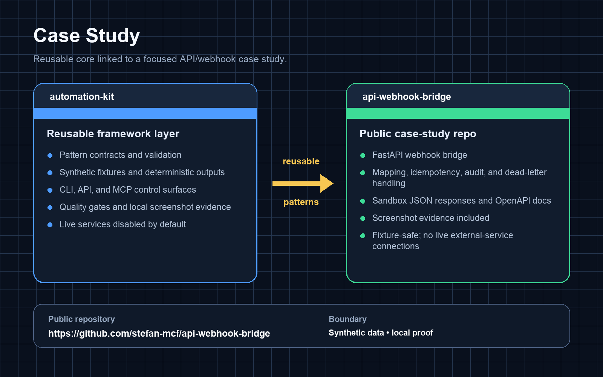

# Automation Kit

Automation Kit is a local-first library of reusable automation patterns for n8n, Make, Zapier, and Python delivery work. Each pattern pairs a low-code-style workflow contract with deterministic fixtures, a tested Python equivalent, and clear notes about when to stay in low-code versus when to use code.

The repository is safe to run from a clean checkout: all data is synthetic, external-service clients are mocked by default, and the ComfyUI boundary refuses live network calls unless explicitly enabled at runtime.

## What it includes

| # | Pattern | Best fit | Output proof |
|---|---------|----------|--------------|
| 1 | `csv-to-crm` | CSV lead imports and CRM hygiene | Deduplicated mock CRM upserts |
| 2 | `email-parser` | Support, sales, billing, and spam triage | Routed classification result |
| 3 | `lead-enrichment` | B2B prospect enrichment | Firmographic records and manual-research flags |
| 4 | `calendar-booking` | Booking requests and availability checks | Event decision and confirmation message |
| 5 | `webhook-router` | third-party event fan-out | Typed handler result or dead-letter queue item |
| 6 | `slack-alerts` | Ops alerts and team notifications | Severity-routed mock Slack messages |
| 7 | `product-creative-pack` | Ecommerce creative asset preparation | Prompt pack, ComfyUI manifest, mock assets, review packet |

Every pattern lives under `patterns/<name>/` with:

- `workflow.json` — declarative workflow structure.
- `fixtures/` — synthetic inputs plus `expected_output.json`.
- `python/main.py` — runnable Python equivalent.
- `python/test_*.py` — pattern-specific regression tests.
- `README.md` — implementation notes and automation fit.

## Core plus case-study architecture

Automation Kit is the core framework. Companion case-study repositories show this toolkit applied to one concrete workflow at a time. A case study should stay thin: use Automation Kit for reusable pattern behavior, add only the workflow-specific mapping or API surface, and prove the result with synthetic fixtures, deterministic outputs, tests, evidence, and screenshots.

The public API/webhook case study is [`api-webhook-bridge`](https://github.com/stefan-mcf/api-webhook-bridge). See [`docs/case-studies/api-webhook-bridge.md`](docs/case-studies/api-webhook-bridge.md) for the Automation Kit relationship.

## Quick start

```bash
python -m venv .venv
source .venv/bin/activate
pip install -e ".[dev]"

auto-kit list-patterns
auto-kit validate-all
auto-kit run patterns/csv-to-crm
python -m pytest -q
```

Source-checkout module invocation also works without installing the console script:

```bash
PYTHONPATH=src python -m auto_kit.cli validate-all
```

## CLI reference

| Command | Description |
|---------|-------------|
| `auto-kit list-patterns` | Discover all pattern directories with descriptions. |
| `auto-kit validate <path>` | Validate one pattern's structure and workflow JSON. |
| `auto-kit validate-all` | Validate every discoverable pattern. |
| `auto-kit run <path>` | Execute a pattern and compare output with `fixtures/expected_output.json`. |
| `auto-kit mcp-validate` | Validate the packaged sector/capability registry. |
| `auto-kit mcp-serve` | Start the fixture-safe MCP server. |

## Architecture decision guide

| Use low-code when... | Use Python when... |
|----------------------|--------------------|
| The workflow is mostly trigger, transform, route, and notify. | Inputs need strict validation or repeatable transformations. |
| A non-developer team will maintain the automation inside n8n, Make, or Zapier. | Edge cases, deduplication, or enrichment rules need tests. |
| The integration path is clear and credentials are already approved. | Credentials are not approved and mock-first proof is safer. |
| A visual handoff helps reviewers understand the flow. | CI, Docker, or local reproducibility matters for delivery confidence. |

Automation Kit keeps both views visible: `workflow.json` explains the low-code flow, while `python/main.py` proves the same logic can run deterministically under tests.

## ComfyUI boundary

The `product-creative-pack` pattern models an ecommerce creative workflow: product brief, prompt pack, ComfyUI job manifest, deterministic mock assets, and a human review packet. It does not generate images by default.

Live ComfyUI calls are isolated behind `auto_kit.comfyui_client.ComfyUIClient`, which raises before any network operation unless `AUTO_KIT_USE_LIVE_SERVICES=true` and `COMFYUI_BASE_URL` are supplied in the local runtime environment.

## Local API proof

```bash
PYTHONPATH=src uvicorn auto_kit.api:app --host 127.0.0.1 --port 8000
curl -fsS http://127.0.0.1:8000/health
curl -fsS http://127.0.0.1:8000/patterns
```

The local API exposes FastAPI/OpenAPI docs for fixture-safe pattern runs. It reports `fixture_safe=true` and `live_services_used=false`; it does not connect live external-service credentials. See [`docs/api.md`](docs/api.md).

## MCP surface

Automation Kit also exposes a fixture-safe MCP control surface for agents to inspect patterns, sectors, capabilities, and evidence metadata without live service side effects. See [`docs/mcp.md`](docs/mcp.md).

## Docker

```bash
docker build -t automation-kit .
docker run --rm automation-kit list-patterns
docker run --rm automation-kit validate-all
```

The container entrypoint is `auto-kit`, so arguments after the image name are CLI subcommands.

## Documentation and evidence

- [`docs/pattern-index.md`](docs/pattern-index.md) — inputs, outputs, automation value, and fit for every pattern.
- [`docs/architecture.md`](docs/architecture.md) — package boundaries, runtime flow, and ComfyUI isolation.
- [`docs/api.md`](docs/api.md) — local FastAPI/OpenAPI proof surface for fixture-safe pattern runs.
- [`docs/mcp.md`](docs/mcp.md) — fixture-safe MCP surface and capability registry.
- [`docs/deployment.md`](docs/deployment.md) — local Docker Compose API mode, healthcheck, and cloud-free deployment boundary.
- [`docs/proof-spoke-architecture.md`](docs/proof-spoke-architecture.md) — core/case-study architecture and readiness contract.
- [`docs/case-studies/api-webhook-bridge.md`](docs/case-studies/api-webhook-bridge.md) — public API/webhook case study relationship.
- [`docs/screenshots/`](docs/screenshots/) — visual proof panels for CLI validation, pattern outputs, architecture, quality gates, and the case-study link.
- [`docs/public-readiness.md`](docs/public-readiness.md) — public-surface safety checks and current gate status.
- [`EVIDENCE.md`](EVIDENCE.md) — latest verification command bundle.

## Evidence package

Below is the local proof-of-concept evidence for Automation Kit: CLI validation, pattern
outputs, architecture, quality gates, and the case-study relationship.

[](docs/screenshots/01-cli-validation.png)

[](docs/screenshots/02-pattern-output.png)

[](docs/screenshots/03-architecture.png)

[](docs/screenshots/04-quality-gates.png)

[](docs/screenshots/05-case-study-link.png)

## Quality gates

```bash
python -m pytest -q
python -m ruff check .
python -m mypy src
PYTHONPATH=src python -m auto_kit.cli validate-all
PYTHONPATH=src python -m auto_kit.cli mcp-validate
docker build -t automation-kit:local .
docker run --rm automation-kit:local validate-all
```

## Environment

See `.env.example`:

| Variable | Default | Description |
|----------|---------|-------------|
| `AUTO_KIT_USE_LIVE_SERVICES` | `false` | Explicit opt-in gate for live API clients. |
| `AUTO_KIT_MOCK_SEED` | `42` | Seed for deterministic mock data. |
| `COMFYUI_BASE_URL` | empty | Optional local or cloud ComfyUI base URL. |
| `COMFY_CLOUD_API_KEY` | empty | Optional Comfy Cloud key supplied only outside git. |

## Repository layout

```text
src/auto_kit/
  api.py
  capability_registry.py
  cli.py
  comfyui_client.py
  fixtures.py
  mcp_server.py
  mock_clients.py
  models.py
  pattern_runner.py
  registry/
  workflow_schema.py
patterns/
  <pattern-name>/
    workflow.json
    README.md
    fixtures/
    python/
docs/
  architecture.md
  api.md
  case-studies/
  deployment.md
  mcp.md
  pattern-index.md
  proof-spoke-architecture.md
  public-readiness.md
  screenshots/
examples/
  api-requests/
  api-responses/
  mcp/
registry/
  capabilities.yaml
  sectors.yaml
```

## License

MIT License. See [`LICENSE`](LICENSE).
