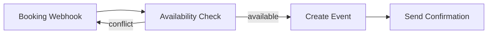

# Calendar Booking Pattern

A timezone-aware calendar availability checker that detects double-booking
conflicts and suggests alternative time slots.

## Problem

Calendar booking is deceptively complex. Two common pitfalls:

### 1. Timezone handling

A slot expressed as `2025-06-15T14:00` in America/New_York (EDT, UTC-4)
is `18:00 UTC`. If the system treats both as naive (timezone-unaware)
datetimes, comparisons across timezones silently break.

**In this pattern:** `TimeSlotManager` uses Python's `zoneinfo.ZoneInfo`
to attach timezone info to parsed dates via `datetime.replace(tzinfo=tz)`.
Existing event times from fixtures are parsed with `datetime.fromisoformat()`
which preserves their embedded UTC offsets (e.g. `-04:00`).

All overlap comparisons happen on `datetime` objects that carry tzinfo,
so `2025-06-15T14:00:00-04:00` correctly compares equal to
`2025-06-15T18:00:00+00:00`.

### 2. Double-booking / overlap detection

Two slots can relate in several overlapping ways:

- A is fully inside B: `A.start >= B.start and A.end <= B.end`
- A overlaps B's start: `A.start < B.start < A.end < B.end`
- A overlaps B's end: `B.start < A.start < B.end < A.end`
- A fully contains B: `A.start < B.start and A.end > B.end`

The naive check `A.start < B.end and A.end > B.start` correctly handles
all four cases and is the implementation used in this pattern.

## Fixtures

| File | Purpose |
|------|---------|
| `fixtures/input.json` | Booking request with a conflicting event, plus background events |
| `fixtures/expected_output.json` | Expected result for the conflict scenario |

## Usage

```python
from auto_kit.pattern_runner import run_pattern_module

result = run_pattern_module("patterns/calendar-booking")
print(result.summary())
```

Or run directly:

```bash
python patterns/calendar-booking/python/main.py
```

## Output fields

| Field | Type | Description |
|-------|------|-------------|
| `available` | bool | True if the requested slot is free |
| `suggested_slots` | list[dict] | Up to 3 alternative slots when unavailable |
| `event` | dict or null | Created event details when available |
| `conflict_reason` | str or null | Human-readable conflict description |

## Alternative slot strategy

When a conflict is detected, the manager suggests up to 3 alternatives:

1. **Right after** the conflicting event (same day)
2. **Right before** the conflicting event (same day)
3. **Same time, next calendar day**

Each suggestion is verified against *all* existing events before inclusion.

## Workflow (n8n-style)



Nodes:
1. **Booking Webhook** — receives POST requests with slot + attendee data
2. **Availability Check** — runs TimeSlotManager logic
3. **Create Event** — creates calendar entry on available slots
4. **Send Confirmation** — emails attendee with booking details
